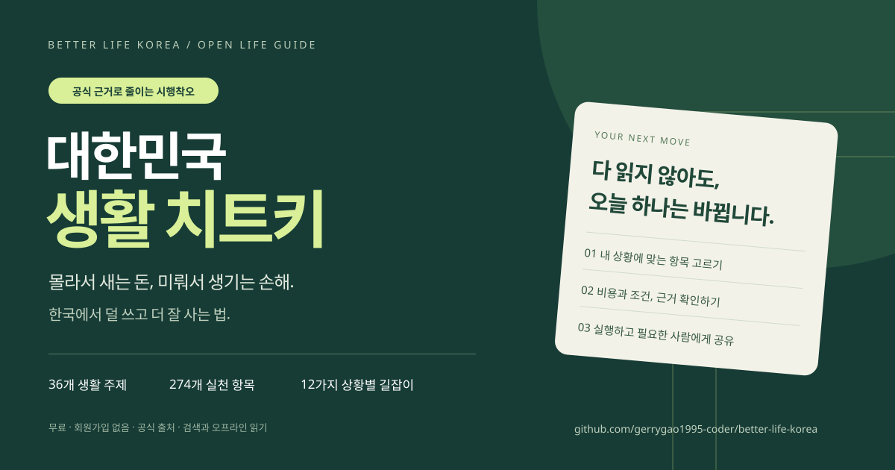

# 대한민국 생활 치트키 🇰🇷

**몰라서 새는 돈, 미뤄서 생기는 손해. 한국에서 덜 쓰고 더 잘 사는 법.**

전세 계약, 건강과 병원, 일과 돈, 관계, 군복무, 임신·육아, 사업, 노후와 사별까지. **36개 주제 · 274개 실천 항목 · 306개의 서로 다른 출처 URL**을 한국 생활에 맞게 정리했습니다.

**[온라인에서 바로 읽기 →](https://gerrygao1995-coder.github.io/better-life-korea/)** · [전체 본문](GUIDE.ko.md) · [상황별 길잡이](PLAYBOOKS.ko.md) · [EPUB 전자책](better-life-korea.epub) · [ZIP 내려받기](https://github.com/gerrygao1995-coder/better-life-korea/archive/refs/heads/main.zip)

무료 · 회원가입 없음 · 광고·추적 코드 없음 · 오프라인 읽기 · 출처 확인 기준 **2026-10-09**

## 전세 계약을 앞두고 있다면

**[보증금 보호 체크리스트 열기 →](https://gerrygao1995-coder.github.io/better-life-korea/jeonse.html)**

계약 전·계약 체결·잔금과 입주·계약 종료의 10가지 확인과 멈출 신호입니다. [본문 문서](JEONSE.ko.md) · [공유 이미지](SHARING.ko.md#전세-체크리스트-공유) · [공식 출처 웹페이지](https://gerrygao1995-coder.github.io/better-life-korea/sources.html) · [의견과 검토 안내](FEEDBACK.ko.md)

## 이럴 때 열어보세요

| 지금 내 상황 | 읽는 순서 |
| --- | --- |
| 처음 독립하거나 집 계약을 앞뒀다 | [주거비 → 권리관계 → 보증금 → 이사](PLAYBOOKS.ko.md#첫-집-계약과-독립) |
| 갑자기 일이나 소득이 끊겼다 | [남은 돈 → 구직급여 → 지원 → 재취업](PLAYBOOKS.ko.md#갑자기-실직했을-때) |
| 건강을 챙기려는데 어디서 시작할지 모르겠다 | [건강과 의료비](book/chapter-01.md), [수면·스트레스](book/chapter-11.md), [식사·예방습관](book/chapter-12.md) |
| 아이가 태어나거나 부모님 돌봄이 필요하다 | [임신·신생아](book/chapter-14.md), [가족 돌봄](book/chapter-29.md) |
| 취업·대학·군복무·출국을 준비한다 | [진로](book/chapter-25.md), [대학](book/chapter-26.md), [군복무](book/chapter-27.md), [해외](book/chapter-28.md) |
| 부업·가게·온라인 서비스를 시작한다 | [사업 시작](book/chapter-22.md), [가게 운영](book/chapter-23.md), [플랫폼·개인정보](book/chapter-24.md) |
| 계약·사기·관계 문제로 불안하다 | [법적 대응](book/chapter-20.md), [금융사기](book/chapter-04.md), [관계 안전](book/chapter-19.md) |

## 읽고 끝내지 않도록 만들었습니다

- **12가지 상황별 경로:** 지금 겪는 일에 따라 관련 항목을 읽는 순서로 묶었습니다.
- **4가지 생활 계산기:** 고정비 변경, 주거비 비교, 자금 소진기간, 통근시간 차이를 내 숫자로 계산합니다.
- **검색과 필터:** 주제·실행 시점·근거 유형·내 목록을 함께 좁힐 수 있습니다.
- **저장과 완료 표시:** 이 브라우저에만 남습니다. JSON으로 내보내 다른 기기로 옮길 수 있습니다.
- **한 항목씩 공유:** 각 항목에 고유 링크가 있습니다. 필요한 사람에게 필요한 내용만 보낼 수 있습니다.
- **인쇄와 오프라인:** ZIP을 풀어 index.html을 열면 인터넷 없이 읽고 검색할 수 있습니다. 외부 출처를 열 때만 인터넷이 필요합니다.

## 모든 항목은 같은 질문에 답합니다

| 질문 | 본문에 담긴 것 |
| --- | --- |
| 지금 무엇을 하면 되나? | 구체적인 다음 행동 |
| 돈과 시간이 얼마나 드나? | 비용·자기부담·시간의 범위 |
| 무엇이 좋아질 수 있나? | 기대효과와 보장할 수 없는 부분 |
| 누구에게 해당하나? | 적용 조건·예외·주의할 상황 |
| 무엇을 믿고 썼나? | 공식 지침 / 제도·법령 / 실용 판단 구분 |
| 직접 확인하려면? | 원문 출처와 확인일 |

‘먼저 / 해당할 때 / 꾸준히’는 편집상 실행 순서입니다. 개인의 건강·소득·가족 상황에 따라 우선순위는 달라집니다. 기관이 운영하는 서비스의 존재와 내 자격 승인은 다른 문제이며, 금액·기한·요건은 신청일 공고로 확인하세요. [읽는 방법과 근거 기준](INTRO.ko.md)

## 36개 주제 전체 목차

| 장 | 항목 수 |
| --- | ---: |
| [01 건강과 의료비](book/chapter-01.md) | 6 |
| [02 응급상황과 안전](book/chapter-02.md) | 6 |
| [03 전월세와 주거](book/chapter-03.md) | 6 |
| [04 저축 부채와 금융사기](book/chapter-04.md) | 6 |
| [05 교통과 이동비](book/chapter-05.md) | 6 |
| [06 일자리와 노동권](book/chapter-06.md) | 6 |
| [07 복지와 노후](book/chapter-07.md) | 6 |
| [08 가족과 돌봄](book/chapter-08.md) | 6 |
| [09 생활비와 소비](book/chapter-09.md) | 6 |
| [10 디지털 생활과 배움](book/chapter-10.md) | 6 |
| [11 수면 스트레스와 정신건강](book/chapter-11.md) | 8 |
| [12 식사 체중과 예방습관](book/chapter-12.md) | 10 |
| [13 만성질환과 장애](book/chapter-13.md) | 8 |
| [14 임신 출산과 신생아](book/chapter-14.md) | 10 |
| [15 아동 청소년 건강과 학교](book/chapter-15.md) | 8 |
| [16 외모 시술과 의료 선택](book/chapter-16.md) | 6 |
| [17 집중 시간과 디지털 균형](book/chapter-17.md) | 8 |
| [18 연애 결혼과 가계 합의](book/chapter-18.md) | 8 |
| [19 이별 폭력과 관계 안전](book/chapter-19.md) | 8 |
| [20 계약 분쟁과 법적 대응](book/chapter-20.md) | 10 |
| [21 일상에서 지켜야 할 법률](book/chapter-21.md) | 8 |
| [22 프리랜서 부업과 사업 시작](book/chapter-22.md) | 8 |
| [23 가게 운영 고용과 세금](book/chapter-23.md) | 8 |
| [24 개발자 플랫폼 운영과 개인정보](book/chapter-24.md) | 10 |
| [25 경력 설계와 재취업](book/chapter-25.md) | 8 |
| [26 대학 장학금과 청년 진로](book/chapter-26.md) | 8 |
| [27 군복무와 전역](book/chapter-27.md) | 8 |
| [28 해외여행 유학과 귀국](book/chapter-28.md) | 10 |
| [29 노후와 가족 돌봄 실무](book/chapter-29.md) | 8 |
| [30 사별 상속과 장례](book/chapter-30.md) | 8 |
| [31 소비자 권리 보험과 분쟁](book/chapter-31.md) | 8 |
| [32 재난 교통사고와 생활안전](book/chapter-32.md) | 8 |
| [33 돈이 부족할 때의 회복계획](book/chapter-33.md) | 8 |
| [34 취미 관계와 지역생활](book/chapter-34.md) | 8 |
| [35 주택구입 대출과 이사](book/chapter-35.md) | 8 |
| [36 큰 일을 겪은 뒤의 첫 30일](book/chapter-36.md) | 6 |

## 시작과 공유

[30일 실행 안내](START-HERE.ko.md) · [공유용 문구와 이미지](SHARING.ko.md) · [출처 목록](SOURCES.md) · [수정·기여 방법](CONTRIBUTING.md) · [원작 주제 대응표](COVERAGE.ko.md)

이 가이드는 모든 항목을 수행하라는 과제표가 아닙니다. 오늘 내게 필요한 한두 개를 골라도 충분합니다. 도움이 됐다면 저장소를 Star로 보관하거나, 관련 항목 링크를 필요한 사람에게 보내주세요.

## 수정하고 다시 만들기

원본은 data/guide.json과 data/routes.json입니다. 수정 후 다음을 실행하면 본문·장별 문서·출처·읽기 페이지가 함께 갱신됩니다. 외부 패키지는 필요 없습니다. EPUB은 Python 3가 설치된 환경에서 python tools/build-epub.py로 다시 만들 수 있습니다.

~~~sh
node tools/build.mjs
~~~

| 파일 | 용도 |
| --- | --- |
| GUIDE.ko.md / book/ | 전체 본문 / 장별 본문 |
| index.html | 검색·저장·계산기가 포함된 독립 HTML |
| data/guide.json / data/routes.json | 항목과 읽기 경로 원본 |
| tools/build.mjs / tools/reader.html | 생성기와 페이지 틀 |
| social-preview.png / cover.svg | 공유 이미지와 표지 |
| SOURCES.md / COVERAGE.ko.md | 출처 / 원작과의 주제 대응 |

## 원작과 한국판

원작은 [eternity4719/HowToLiveBetter — 高性价比人生指南](https://github.com/eternity4719/HowToLiveBetter)입니다. 비용·효과·근거를 함께 보는 형식을 참고하고 한국의 법률·생활 제도·기관·사례로 재구성했습니다.

원작의 34개 대주제를 대응표로 확인할 수 있으며 한국의 군복무 등 별도 주제를 더했습니다. **원작 672항목의 일대일 번역본은 아닙니다.** 한국판은 274개 항목으로 다시 묶은 독립 현지화·확장판이며, 모든 세부 예외를 망라했다거나 원작보다 효과가 검증됐다는 뜻이 아닙니다. 원작 저자의 공식 검토·승인을 의미하지 않습니다.

본문 **[CC BY 4.0](LICENSE-CONTENT.md)** · 생성·표시 코드 **[MIT](LICENSE-CODE)** · [원작 표기와 변경 내역](ATTRIBUTION.md) · [버전 기록](CHANGELOG.md)
