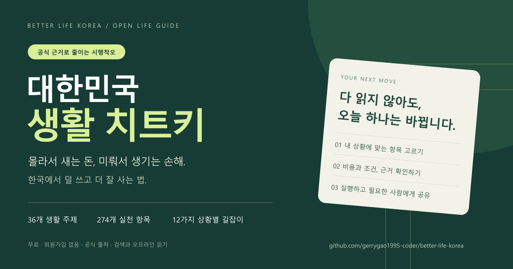

# 필요한 사람에게, 필요한 한 항목씩

가이드 주소: https://gerrygao1995-coder.github.io/better-life-korea/

저장소: https://github.com/gerrygao1995-coder/better-life-korea

## 한 줄 소개

> 전세·병원·퇴직·육아·군복무까지, 몰라서 생기는 생활의 손해를 줄이는 무료 한국 생활 설명서.

## 친구에게 보낼 때

> 이사나 퇴직, 병원비처럼 갑자기 알아봐야 할 일이 생겼을 때 쓰기 좋은 가이드야. 해야 할 일뿐 아니라 비용, 해당 조건, 공식 출처도 같이 나와 있어. 전부 읽기보다 지금 필요한 항목부터 골라봐.  
> https://gerrygao1995-coder.github.io/better-life-korea/

## 커뮤니티에 소개할 때

> **대한민국 생활 치트키 — 한국에서 덜 쓰고 더 잘 사는 법**  
> 건강·주거·일·관계·사업·돌봄·노후 등 36개 주제를 한국 제도에 맞게 정리한 공개 가이드입니다. 상황별 읽기 경로, 생활 계산기, 저장·완료 표시, 오프라인 읽기를 지원합니다.  
> 각 항목에 실행 방법, 비용과 시간, 적용 조건, 근거 유형과 출처를 붙였습니다. 금액·자격·기한은 신청일의 공식 공고를 확인해야 합니다. 오류 제보와 근거 있는 수정도 환영합니다.  
> https://github.com/gerrygao1995-coder/better-life-korea

## 이미지를 함께 보낼 때

[PNG 내려받기](social-preview.png) · [SVG 표지](cover.svg)

## 공유할 때 지켜야 할 것

- 적용 조건이 중요한 항목은 제목만 떼어 보내지 말고 본문 링크를 함께 보냅니다.
- 오래 저장한 이미지보다 최신 본문과 공식 출처를 우선합니다.
- 개인의 의료·금융·가족 상황을 공개하지 않습니다.
- 공식 정부 사이트, 원작자의 공식 한국판, 개인별 자격 판정 도구라고 소개하지 않습니다.
- 내용 재사용 시 프로젝트와 원작의 출처, CC BY 4.0 링크, 변경 사실을 표시합니다. [표기 방법](ATTRIBUTION.md)

이 파일의 문구는 사용자가 직접 게시할 때 활용하는 초안입니다. 저장소에 포함했다는 이유로 다른 커뮤니티에 자동 게시하지 않습니다.
